# Technical Design: Build relationships using bash script

## Overview

Automate relationship diagram generation by replacing the prompt-based build-relationships workflow with a bash script. The script parses contexts.yml, extracts domain and relationship information, and generates domain-{context-name}.md files with Mermaid diagrams showing context maps and relationships per context.

## Architecture

### Key components

**Feature components:**

- [x] create: [build-rels.sh: bash script](../../u/scripts/build-rels.sh)
  - Standalone script that generates domain relationship files from contexts YAML
  - Accepts contexts file path as command-line parameter
  - Parses YAML using grep/sed/awk
  - Generates one domain-{domain-name}.md file per domain in uspecs/

**External components:**

- [x] update: [uspecs.sh: bash script](../../u/scripts/uspecs.sh)
  - Add domains command that calls build-rels.sh
  - Used by: main.md action dispatcher

- [x] update: [main.md: documentation](../../u/main.md)
  - Update "Build relationships" section to reference uspecs.sh instead of build-relationships.md
  - Used by: Agent instructions

**External systems:**

- [contexts.yml: YAML file](../../contexts.yml)
  - Source of domain, context, participant, and relationship data
  - Used by: build-rels.sh

### Key flows

- [x] Generate domain relationship files


- [x] Parse YAML structure

```mermaid
flowchart TD
    parse["🎯 Parse YAML"]
    domains["🎯 Extract domains array"]
    domain["🎯 Extract domain properties"]
    parts["🎯 Extract participants"]
    rels["🎯 Extract relationships"]
    gen["🎯 Generate domain file"]
    
    parse --> domains
    domains --> domain
    domain --> parts
    domain --> rels
    parts --> gen
    rels --> gen
```



## File updates

- [x] create: [build-rels.sh](../../u/scripts/build-rels.sh)
  - Bash script with functions: parse_yaml, extract_domains, extract_contexts, extract_participants, extract_relationships, generate_context_map, generate_context_diagram, sanitize_name, main
  - Accepts one argument: path to contexts.yml file
  - Fail fast on missing file or parse errors
  - Generate uspecs/domain-{domain-name}.md for each domain
  - Output file paths to stdout

- [x] update: [uspecs.sh](../../u/scripts/uspecs.sh)
  - Add domains subcommand with build action
  - Call build-rels.sh with contexts file path parameter
  - Example: `uspecs.sh domains build uspecs/contexts.yml`

- [x] update: [main.md](../../u/main.md)
  - Replace "Build relationships" section content
  - Change from "Use `uspecs/u/build-relationships.md`" to "Call `uspecs.sh domains build <contexts-file-path>`"

- [x] delete: `[build-relationships.md](../../u/build-relationships.md)`
  - Remove deprecated prompt-based workflow

## Quick start

Generate domain relationship files from contexts:

```bash
bash uspecs/u/scripts/build-rels.sh uspecs/contexts.yml
```

Or via uspecs wrapper:

```bash
bash uspecs/u/scripts/uspecs.sh domains build uspecs/contexts.yml
```

Generated files appear in `uspecs/domain-{domain-name}.md` for each domain.

## References

- [example-context.md](example-context.md) - Output file template structure
- [unclear.md](unclear.md) - Clarification decisions for implementation
- [u/conf.md](../../u/conf.md) - Configuration reference
- [u/fd.md](../../u/fd.md) - Relationship type definitions
