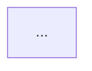

# Domain: {Domain-description}

## Participants

Roles:

- 👤Role
  - Description
  
External systems:

- ⚙️ External System
  - Description

## Contexts

- Context
  - Description

## Context map



## Relationships for context: {context-name}

```mermaid
flowchart TD
```
