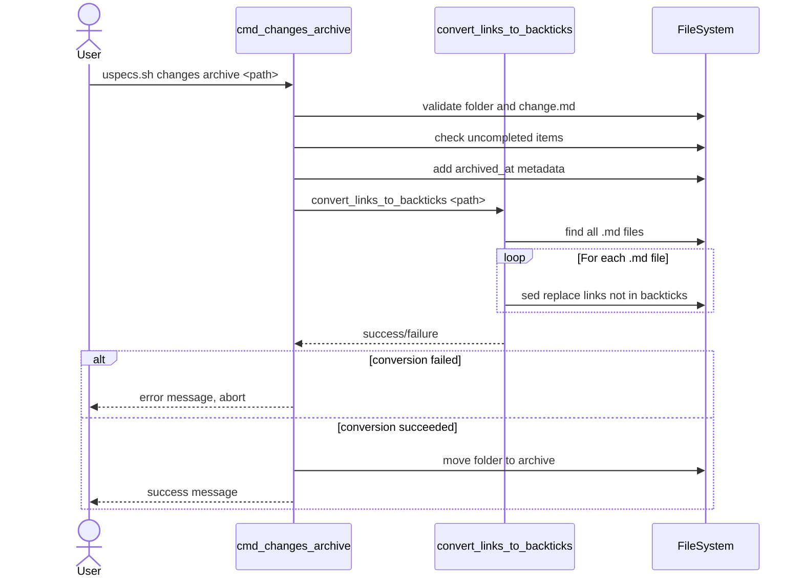

# Technical Design: Archive script should put all links into backticks

## Overview

Extend the cmd_changes_archive function in uspecs.sh to automatically convert all markdown links to backtick-wrapped format when archiving changes. The conversion happens after adding archived_at metadata but before moving the folder, using sed for efficient batch processing.

## Architecture

### Key components

**Feature components:**

- [x] create: `[convert_links_to_backticks: bash function](../../u/scripts/uspecs.sh)`
  - Converts markdown links to backtick-wrapped format in all .md files within a folder
  - Uses sed to find and wrap links that are not already in backticks
  - Returns 0 on success, 1 on failure

**External components:**

- [x] update: `[cmd_changes_archive: bash function](../../u/scripts/uspecs.sh)`
  - Add link conversion step after archived_at metadata insertion
  - Call convert_links_to_backticks before moving folder to archive
  - Abort archive operation if conversion fails

### Key flows

- [x] Archive change with link conversion



## File updates

- [x] update: `[uspecs.sh](../../u/scripts/uspecs.sh)`
  - Add convert_links_to_backticks function before cmd_changes_archive
  - Function accepts folder path parameter
  - Use find to locate all .md files in folder
  - Use sed with pattern to wrap links:
  ```text
  s/\([^\`]\)\(\[[^]]*\]([^)]*)\)/\1\`\2\`/g
  ```
  - Skip links already wrapped: pattern checks for no backtick before opening bracket
  - Return exit code 0 on success, 1 on any sed failure
  - In cmd_changes_archive, call convert_links_to_backticks after line 205 (after archived_at insertion)
  - Check return code and abort with error message if conversion fails
  - Only proceed to move_folder if conversion succeeds

## Quick start

Archive a change with automatic link conversion:

```bash
bash uspecs/u/scripts/uspecs.sh changes archive uspecs/changes/251217-archive-script-backtick-links
```

All markdown links in the change folder will be automatically converted to backtick-wrapped format during archiving.

## References

- `[change.md](change.md)` - Original change description
- `[uspecs.sh](../../u/scripts/uspecs.sh)` - Archive script implementation
