# Technical design: Use yq for domain build with bash fallback

## Overview

Refactor domains-build.sh to use yq v4+ for YAML parsing when available, with automatic fallback to existing bash/awk/sed implementation. The implementation uses separate parser files (domains-build-yq.sh for yq-based parsing, domains-build-fb.sh for bash fallback) with a main orchestrator script that detects yq availability and sources the appropriate parser.

## System configuration

When to include: yq is optional - script works without it using bash fallback.

**YAML Processing Tools (Optional)**:

- yq v4.0+ (mikefarah/yq): YAML processor for cleaner, more maintainable parsing
  - Windows: `winget install mikefarah.yq`
  - macOS: `brew install yq`
  - Linux: `wget https://github.com/mikefarah/yq/releases/latest/download/yq_linux_amd64 -O /usr/local/bin/yq && chmod +x /usr/local/bin/yq`
  - Or see: https://github.com/mikefarah/yq#install

## Architecture

### File structure

The implementation separates concerns into three files:

```text
domains-build.sh (main orchestrator)
├── parse_args()              - Parse command-line flags
├── check_yq()                - Detect yq v4+ availability
├── select_parser()           - Source appropriate parser file
├── sanitize_name()           - Shared utility for Mermaid node IDs
├── generate_context_map()    - Generate context relationship diagrams
├── generate_context_diagram() - Generate context detail diagrams
├── error()                   - Error handling
└── main()                    - Orchestrate parsing and generation

domains-build-yq.sh (sourced when yq available)
├── get_domains()             - Extract domain names using yq
├── get_domain_description()  - Extract domain description using yq
├── get_participants()        - Extract participants by type using yq
├── get_participant_description() - Extract participant description using yq
├── get_participant_type()    - Extract participant type using yq
├── get_relationships()       - Extract relationships using yq
└── get_contexts()            - Wrapper for get_participants with type "context"

domains-build-fb.sh (sourced when yq not available)
├── get_domains()             - Extract domain names using awk
├── get_domain_description()  - Extract domain description using awk
├── get_participants()        - Extract participants by type using awk
├── get_participant_description() - Extract participant description using awk
├── get_participant_type()    - Extract participant type using awk
├── get_relationships()       - Extract relationships using awk
└── get_contexts()            - Wrapper for get_participants with type "context"
```

How it works:

1. Main script parses flags and detects yq availability
2. Main script sources either domains-build-yq.sh or domains-build-fb.sh
3. Sourced parser functions become available in the same shell context
4. Main script calls parser functions (get_domains, get_participants, etc.)
5. Main script uses sanitize_name to generate Mermaid-safe identifiers
6. Main script generates diagrams using generate_context_map and generate_context_diagram

### Key components

**Feature components:**

- [x] create: `[domains-build-yq.sh](../../u/scripts/domains-build-yq.sh)`
  - yq v4+ based YAML parser implementation
  - Exports functions: get_domains, get_domain_description, get_participants, get_participant_description, get_participant_type, get_relationships, get_contexts

- [x] create: `[domains-build-fb.sh](../../u/scripts/domains-build-fb.sh)`
  - Bash/awk/sed fallback YAML parser implementation
  - Exports same function interface as domains-build-yq.sh
  - Contains existing awk-based parsing logic

- [x] create: `[check_yq: function](../../u/scripts/domains-build.sh)`
  - Detects yq v4+ availability and version
  - Returns 0 if yq v4+ available, 1 otherwise
  - Prints warning to stderr if yq v3 detected: "Warning: yq v3 detected, please upgrade to v4+. Using bash fallback."
  - Treats version detection failures as "not available"

- [x] create: `[parse_args: function](../../u/scripts/domains-build.sh)`
  - Parses command-line flags: --use-yq, --no-yq, --verbose/-v
  - Sets global variables: USE_YQ_FLAG, NO_YQ_FLAG, VERBOSE_FLAG
  - Handles positional argument (contexts.yml path) after flags

- [x] create: `[select_parser: function](../../u/scripts/domains-build.sh)`
  - Determines which parser to use based on flags and yq availability
  - Sources domains-build-yq.sh or domains-build-fb.sh from script directory
  - Prints to stdout if VERBOSE_FLAG: "Using yq v4 for YAML parsing" or "Using bash fallback for YAML parsing"
  - Exits with error if --use-yq specified but yq not available: "Error: yq not found. Install yq v4+ or remove --use-yq flag"

**Utility components:**

- [x] update: `[error: function](../../u/scripts/domains-build.sh)`
  - Keep in main script, shared by both parsers
  - Used by: main, select_parser

- [x] update: `[sanitize_name: function](../../u/scripts/domains-build.sh)`
  - Keep in main script, shared by both parsers
  - Used by: generate_context_map, generate_context_diagram

- [x] update: `[generate_context_map: function](../../u/scripts/domains-build.sh)`
  - Keep in main script, shared by both parsers
  - Used by: main

- [x] update: `[generate_context_diagram: function](../../u/scripts/domains-build.sh)`
  - Keep in main script, shared by both parsers
  - Used by: main

**External components:**

- [x] update: `[main: function](../../u/scripts/domains-build.sh)`
  - Add parse_args call before processing
  - Add select_parser call to source appropriate parser implementation
  - Keep domain processing logic using parser functions
  - Used by: uspecs.sh domains build command

### Key flows

- [x] Script initialization and parser selection

```mermaid
sequenceDiagram
    actor 👤User
    participant 🎯main
    participant 🎯parse_args
    participant 🎯select_parser
    participant 🎯check_yq
    participant 🎯domains-build-yq.sh
    participant ⚙️yq

    👤User->>🎯main: bash domains-build.sh --verbose contexts.yml
    🎯main->>🎯parse_args: parse flags
    🎯parse_args-->>🎯main: USE_YQ_FLAG=false, NO_YQ_FLAG=false, VERBOSE_FLAG=true
    🎯main->>🎯select_parser: determine parser
    🎯select_parser->>🎯check_yq: check availability
    🎯check_yq->>⚙️yq: yq --version
    ⚙️yq-->>🎯check_yq: yq (https://github.com/mikefarah/yq/) version v4.40.5
    🎯check_yq-->>🎯select_parser: return 0 (available)
    🎯select_parser->>🎯domains-build-yq.sh: source domains-build-yq.sh
    🎯select_parser-->>🎯main: print "Using yq v4 for YAML parsing"
    🎯main->>🎯main: process domains using parser functions
```



- [x] Error handling when --use-yq specified but yq unavailable

```mermaid
sequenceDiagram
    actor 👤User
    participant 🎯main
    participant 🎯parse_args
    participant 🎯select_parser
    participant 🎯check_yq
    participant 🎯error

    👤User->>🎯main: bash domains-build.sh --use-yq contexts.yml
    🎯main->>🎯parse_args: parse flags
    🎯parse_args-->>🎯main: USE_YQ_FLAG=true
    🎯main->>🎯select_parser: determine parser
    🎯select_parser->>🎯check_yq: check availability
    🎯check_yq-->>🎯select_parser: return 1 (not available)
    🎯select_parser->>🎯error: yq not found. Install yq v4+ or remove --use-yq flag
    🎯error-->>👤User: exit 1
```



- [x] yq v3 detection with warning and fallback

```mermaid
sequenceDiagram
    actor 👤User
    participant 🎯main
    participant 🎯parse_args
    participant 🎯select_parser
    participant 🎯check_yq
    participant 🎯domains-build-fb.sh
    participant ⚙️yq

    👤User->>🎯main: bash domains-build.sh contexts.yml
    🎯main->>🎯parse_args: parse flags
    🎯parse_args-->>🎯main: no flags set
    🎯main->>🎯select_parser: determine parser
    🎯select_parser->>🎯check_yq: check availability
    🎯check_yq->>⚙️yq: yq --version
    ⚙️yq-->>🎯check_yq: yq version 3.4.1
    🎯check_yq-->>🎯check_yq: print warning to stderr
    🎯check_yq-->>🎯select_parser: return 1 (v3 treated as unavailable)
    🎯select_parser->>🎯domains-build-fb.sh: source domains-build-fb.sh
    🎯select_parser-->>🎯main: continue with bash parser
```



- [x] Force bash fallback with --no-yq flag

```mermaid
sequenceDiagram
    actor 👤User
    participant 🎯main
    participant 🎯parse_args
    participant 🎯select_parser
    participant 🎯domains-build-fb.sh

    👤User->>🎯main: bash domains-build.sh --no-yq contexts.yml
    🎯main->>🎯parse_args: parse flags
    🎯parse_args-->>🎯main: NO_YQ_FLAG=true
    🎯main->>🎯select_parser: determine parser
    🎯select_parser->>🎯domains-build-fb.sh: source domains-build-fb.sh (skip yq check)
    🎯select_parser-->>🎯main: continue with bash parser
```



## File updates

- [x] create: `[domains-build-yq.sh](../../u/scripts/domains-build-yq.sh)`
  - Add bash header: #!/usr/bin/env bash and set -Eeuo pipefail
  - Add header comment: "YAML parser implementation using yq v4+. Sourced by domains-build.sh."
  - Implement get_domains using yq eval '.domains[].name'
  - Implement get_domain_description using yq eval with domain filter
  - Implement get_participants using yq eval with type filter
  - Implement get_participant_description using yq eval with participant filter
  - Implement get_participant_type using yq eval to extract type field
  - Implement get_relationships using yq eval to extract and format relationships (pipe-delimited output)
  - Implement get_contexts as wrapper calling get_participants with type "context"

- [x] create: `[domains-build-fb.sh](../../u/scripts/domains-build-fb.sh)`
  - Add bash header: #!/usr/bin/env bash and set -Eeuo pipefail
  - Add header comment: "YAML parser fallback implementation using bash/awk/sed. Sourced by domains-build.sh."
  - Move existing get_domains awk implementation from domains-build.sh
  - Move existing get_domain_description awk implementation from domains-build.sh
  - Move existing get_participants awk implementation from domains-build.sh
  - Move existing get_participant_description awk implementation from domains-build.sh
  - Move existing get_participant_type awk implementation from domains-build.sh
  - Move existing get_relationships awk implementation from domains-build.sh
  - Move existing get_contexts implementation from domains-build.sh

- [x] update: `[domains-build.sh](../../u/scripts/domains-build.sh)`
  - Add parse_args function for command-line flag parsing (--use-yq, --no-yq, --verbose/-v)
  - Add check_yq function for yq v4+ detection and version checking with v3 warning
  - Add select_parser function to source appropriate parser file from script directory
  - Remove get_domains, get_domain_description, get_participants, get_participant_description, get_participant_type, get_relationships, get_contexts functions (moved to parser files)
  - Keep error, sanitize_name, generate_context_map, generate_context_diagram functions (shared utilities)
  - Update main function to call parse_args and select_parser before processing
  - Update usage documentation in header comments:
    - Usage: domains-build.sh [--use-yq|--no-yq] [--verbose|-v] <path-to-contexts.yml>
    - Document --use-yq: Force yq usage (error if not available)
    - Document --no-yq: Force bash fallback (ignore yq)
    - Document --verbose/-v: Show which parser is being used
    - Document default behavior: Auto-detect yq and use if available

## Quick start

Run with automatic yq detection (silent):

```bash
bash uspecs/u/scripts/domains-build.sh uspecs/contexts.yml
```

Force yq usage (error if not available):

```bash
bash uspecs/u/scripts/domains-build.sh --use-yq uspecs/contexts.yml
```

Force bash fallback (ignore yq):

```bash
bash uspecs/u/scripts/domains-build.sh --no-yq uspecs/contexts.yml
```

Show which parser is being used:

```bash
bash uspecs/u/scripts/domains-build.sh --verbose uspecs/contexts.yml
```

## References

- `[change.md](change.md)` - Change request details
- `[decisions.md](decisions.md)` - Design decisions and rationale
- https://github.com/mikefarah/yq - yq v4+ official repository
- https://mikefarah.gitbook.io/yq/ - yq v4+ documentation
