# Technical design: Make uimpl deterministic via uspecs.sh script

## Key components

Feature components:

- [cmd_impl_next_action: bash function](../../../../uspecs/u/scripts/uspecs.sh)
  - Analyzes Implementation Plan state and returns next action to execute
  - Returns structured output (key=value format) for deterministic parsing

📦 System components:

- [uspecs.sh: bash script](../../../../uspecs/u/scripts/uspecs.sh)
  - Add new command: `impl next-action <path-to-change-folder>`
  - Used by: actn-impl.md AI Agent instructions

- [actn-impl.md: AI instructions](../../../../uspecs/u/actn-impl.md)
  - Update to call uspecs.sh before processing
  - Parse script output and execute indicated action
  - Used by: AI Agent when processing uimpl command

## Key flows

### AI Agent executes uimpl command

```mermaid
sequenceDiagram
    actor Engineer as 👤Engineer
    participant Agent as 📦AI Agent
    participant Script as 🎯uspecs.sh
    participant ImplPlan as 📁impl.md

    Engineer->>Agent: uimpl
    Agent->>Script: impl next-action <change-folder>
    Script->>ImplPlan: read and analyze
    ImplPlan-->>Script: content
    Script->>Script: determine next action
    Script-->>Agent: action=create_section\nsection=technical_design
    Agent->>Agent: parse output
    Agent->>ImplPlan: create Technical design section
    ImplPlan-->>Agent: success
    Agent-->>Engineer: Section created, stop
```



## Key data models

### Script output format

Simple key=value format for easy parsing:

```text
action=create_section
section=functional_design
```

```text
action=create_section
section=provisioning
```

```text
action=create_section
section=technical_design
```

```text
action=create_section
section=construction
```

```text
action=implement_items
```

```text
action=none
message=No action needed
```

```text
action=error
message=No Active Change Request found
```

### Decision logic (in uspecs.sh)

Priority order (first match wins):

1. If impl.md does not exist -> `action=create_impl`
2. If all items unchecked:
   - If Functional design section missing and needed -> `action=create_section section=functional_design`
   - If Provisioning section missing and needed -> `action=create_section section=provisioning`
   - If Technical design section missing and needed -> `action=create_section section=technical_design`
   - If Construction section missing and needed -> `action=create_section section=construction`
   - Otherwise -> `action=none`
3. If some items checked -> `action=implement_items`

### Section detection logic

Functional design needed:

- Domain Files exist with External actors AND
- Change Request impacts Functional Design Specifications

Provisioning needed:

- Change Request mentions: dependencies, installation, tools, SDKs, databases, services, environment variables, configuration files

Technical design needed:

- Change Request requires new components, functions, modules, data structures NOT in existing specs

Construction needed:

- Always needed if any design sections exist
