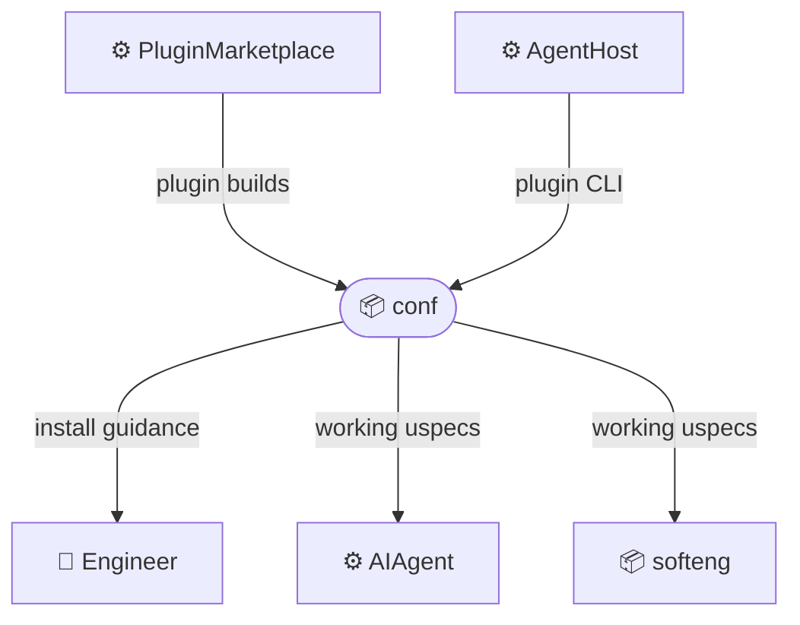
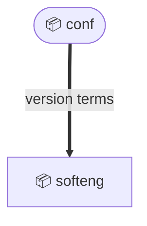
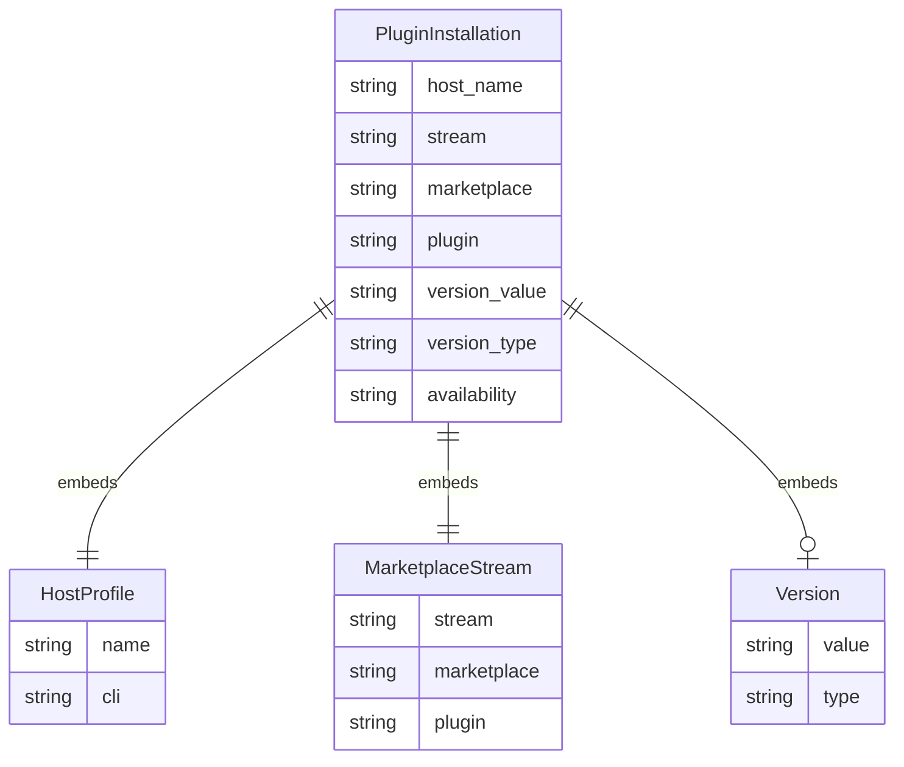

# Bounded Context: conf

## Overview

Configuration and lifecycle management for making uspecs available in an AI agent host.

Scope:

- Select the correct stable or development marketplace stream for an AI agent host.
- Install the uspecs plugin into Claude Code, Augment Code, or Codex.
- Refresh the marketplace and update an existing plugin installation.
- Establish working uspecs so software engineering workflows can be executed from the project root.

Out of scope:

- Authoring or executing software engineering change workflows.
- Creating, updating, or archiving `ChangeFolder` artifacts.
- Creating pull requests or merging branches.
- Operating the plugin marketplace infrastructure.

## External actors

Roles:

- 👤 Engineer
  - Installs or updates uspecs in an AI agent host.

Systems:

- ⚙️ AgentHost
  - Host environment and CLI that installs, updates, and runs the plugin.
- ⚙️ PluginMarketplace
  - Repository that publishes stable and development uspecs plugin builds.
- ⚙️ AIAgent
  - Runs the installed plugin's workflow commands after configuration is complete.

## Relationships

### Service exposure

Arrows point upstream -> downstream. Edge style encodes the exposure pattern:

- `--->` solid: Open Host Service (ohs) - public, general-purpose contract for many consumers

#### AgentHost -> conf: plugin CLI (ohs + cf)

Upstream:

- External provider reference: the supported host CLI command set.
- Supported hosts in the current source material are Claude Code, Augment Code, and Codex.

Downstream:

- Conforms to host-specific plugin marketplace, install, add, update, and upgrade commands.

#### PluginMarketplace -> conf: plugin builds (ohs + cf)

Upstream:

- External provider reference: the stable and development uspecs marketplace repositories.

Downstream:

- Conforms to marketplace stream names and plugin identifiers for installation and update commands.

#### conf: install guidance (ohs + pl)

Provider:

- Contract: installation and update command matrix.
- Language: `InstallationWorkflow.v1`.
- Compatibility: backward-compatible additions for new supported hosts, streams, or command variants.

Consumers:

- 👤 Engineer
  - Uses the guidance to install or update the correct uspecs plugin in the selected agent host.

#### conf: working uspecs (ohs + pl)

Provider:

- Contract: installed plugin state available to the project.
- Language: `WorkingUspecs.v1`.
- Compatibility: backward-compatible additions for new plugin streams or host capabilities.

Consumers:

- ⚙️ AIAgent
  - Runs uspecs workflow commands from the project root after installation.
- 📦 softeng
  - Depends on working uspecs when dispatching software engineering actions and self-review commands.

### Model alignment

Arrows point upstream -> downstream. Edge style encodes the alignment pattern:

- `===>` thick: Published Language (pl) - the upstream publishes a documented, versioned language/model

#### conf -> softeng: version terms (pl)

Upstream:

- Language: `VersionTerms.v1`.
- Terms include Stable build, Development build, installed version, latest available version, update availability, and source repository sentinel version.

Downstream:

- Uses version terminology in the version-reporting action.

## Model specification

### Entities

#### PluginInstallation (aggregate)

Installed uspecs plugin state for one agent host.

Embeds: `HostProfile`, `MarketplaceStream`, `Version`.

Fields:

| Field          | Type                | Description                                                  |
|----------------|---------------------|--------------------------------------------------------------|
| `host`         | `HostProfile`       | Host where the plugin is installed                           |
| `stream`       | `MarketplaceStream` | Stable or development stream                                 |
| `marketplace`  | `string`            | Marketplace repository name                                  |
| `plugin`       | `string`            | Plugin identifier used by the host CLI                       |
| `version`      | `Version`           | Installed plugin version when known                          |
| `availability` | `string`            | Whether a newer version is available, up to date, or unknown |

Invariants:

- `PluginInstallation.host` determines the supported host CLI vocabulary.
- `PluginInstallation.stream` determines the marketplace and plugin identifier pair.
- A working uspecs installation has one selected `HostProfile` and one selected `MarketplaceStream`.

ERD:

### Value Objects

#### HostProfile

Supported AI agent host and its plugin CLI vocabulary.

Fields:

| Field          | Type     | Description                            |
|----------------|----------|----------------------------------------|
| `name`         | `string` | Host name                              |
| `cli`          | `string` | CLI command used by the host           |
| `install_verb` | `string` | Host-specific plugin install verb      |
| `refresh_verb` | `string` | Host-specific marketplace refresh verb |

#### MarketplaceStream

Release stream and marketplace pair.

Fields:

| Field         | Type     | Description                       |
|---------------|----------|-----------------------------------|
| `stream`      | `string` | Stable or development             |
| `marketplace` | `string` | Marketplace repository name       |
| `plugin`      | `string` | Plugin identifier for that stream |

#### Version

Installed or latest available uspecs version.

Fields:

| Field   | Type     | Description                                |
|---------|----------|--------------------------------------------|
| `value` | `string` | Version string                             |
| `type`  | `string` | Stable build, Development build, or Source |
