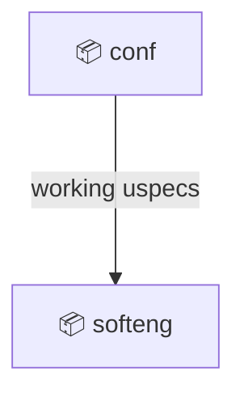
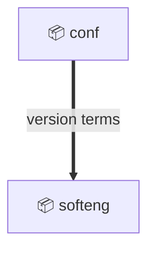

# Domain: prod

## Executive summary

AI-assisted software engineering framework for human-AI collaboration on software design, specification, construction, review, and delivery.

Scope:

- Help `👤 Engineer` use `⚙️ AIAgent` to create, clarify, plan, implement, review, synchronize, archive, and deliver software change requests.
- Maintain source-aligned specifications for product domains, functional behavior, technical design, provisioning, and construction work.
- Support greenfield and brownfield projects with lightweight workflow actions and generated agent instructions.
- Install, update, and report on uspecs framework plugin versions across supported AI agent hosts.

Out of scope:

- Operating production infrastructure for a software product built with uspecs.
- Owning business-domain logic for projects that use uspecs.
- Replacing source control, pull request hosting, issue tracking, or AI agent hosts.
- Defining the devops domain for building, testing, releasing, deploying, and operating software.

## Subdomains

### Collaborative software engineering (Core)

Coordinate human-AI software engineering workflows around explicit change requests, source-derived specifications, implementation plans, and review loops.

| Capability                                                    | Realized by |
|---------------------------------------------------------------|-------------|
| Change request creation and issue intake                      | softeng     |
| Implementation planning and todo execution                    | softeng     |
| Specification clarification and synchronization               | softeng     |
| Self-review of specifications and construction artifacts      | softeng     |
| Pull request preparation, merge handling, and change archival | softeng     |
| Framework version reporting during engineering workflows      | softeng     |

### Framework lifecycle management (Supporting)

Establish and refresh a working uspecs installation inside a supported AI agent host.

| Capability                                            | Realized by   |
|-------------------------------------------------------|---------------|
| Plugin installation                                   | conf          |
| Plugin update                                         | conf          |
| Marketplace stream selection                          | conf          |
| Working uspecs availability for engineering workflows | conf, softeng |

## External actors

Roles:

- 👤 Engineer
  - Software engineer who asks `⚙️ AIAgent` to perform uspecs workflows and reviews resulting artifacts.

Systems:

- ⚙️ AIAgent
  - Agent host participant that follows uspecs instructions, runs shell commands, edits artifacts, and reports results.
- ⚙️ AgentHost
  - Claude Code, Augment Code, Codex, or another environment that installs and runs uspecs plugins.
- ⚙️ PluginMarketplace
  - Distribution source for stable and development uspecs plugin builds.
- ⚙️ GitRepository
  - Source control system containing project source files, specifications, branches, and diffs.
- ⚙️ PullRequestHost
  - External service addressed through pull request tooling for PR creation, update, merge, and browser opening.
- ⚙️ IssueTracker
  - External source of issue URLs and issue bodies used by change-request workflows.
- ⚙️ Browser
  - External application opened for pull request inspection and manual handling.

## Bounded Contexts

- [conf](conf/context.md)
  - System lifecycle management and configuration for installing and updating working uspecs in supported AI agent hosts.

- [softeng](softeng/context.md)
  - Human-AI collaborative software engineering workflows for change requests, planning, specification maintenance, construction assistance, review, PR handling, archival, synchronization, and version reporting.

### Service exposure

Arrows point upstream -> downstream. Edge style encodes the exposure pattern:

- `--->` solid: Open Host Service

### Service exposure index

| Upstream | Downstream | Contract                    | Exposure          | Alignment          |
|----------|------------|-----------------------------|-------------------|--------------------|
| conf     | softeng    | working uspecs installation | Open Host Service | Published Language |

### Model alignment

Arrows point upstream -> downstream. Edge style encodes the alignment pattern:

- `===>` thick: Published Language

### Model alignment index

| Upstream | Downstream | Model/language | Alignment          |
|----------|------------|----------------|--------------------|
| conf     | softeng    | version terms  | Published Language |
