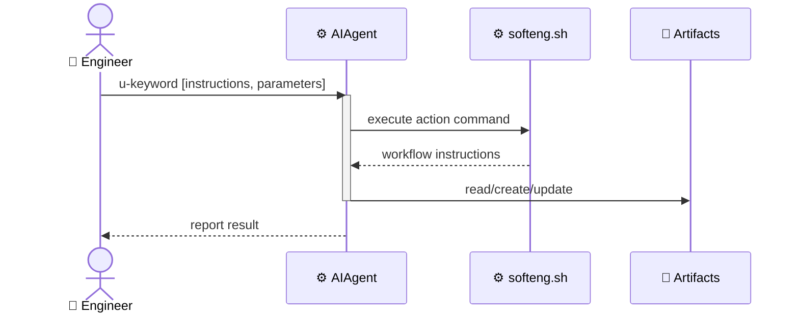
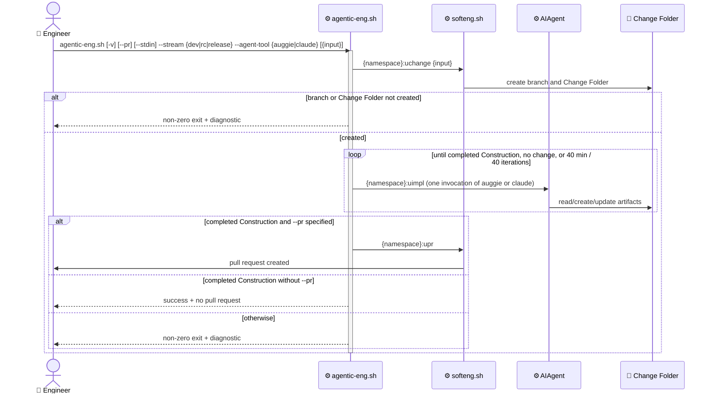

# Context architecture: softeng

## Overview

Most softeng actions follow a single uniform pattern. `👤 Engineer` triggers an action with a `u-keyword`, `⚙️ AIAgent` runs `softeng.sh` to get workflow instructions, reads/creates/updates artifact files, and runs shell commands. The result is reported back to `👤 Engineer`.

`uclarify` is the exception: it has no `softeng.sh` dispatch. `⚙️ AIAgent` reads the action body directly from `scripts/templates/actions/uclarify.md` (in installed plugins, the rendered command/skill) and executes its instructions.

`agentic-eng` is a further exception: it is not an `⚙️ AIAgent`-invoked action at all. `👤 Engineer` runs the standalone script `scripts/agentic-eng.sh` with input plus named `--stream` (`dev`, `rc`, or `release`) and `--agent-tool` (`auggie` or `claude`) parameters. The script orchestrates the whole change workflow by driving the selected tool in a loop -- inverting the generic pattern, so the script drives `⚙️ AIAgent` rather than the reverse.

## Key flows

### Generic flow

All softeng actions follow the same pattern:



### Self-review flow

`self-review` is a top-level softeng command (not an action). It is auto-invoked by `⚙️ AIAgent` at the end of a `uimpl` cycle that completed at least one to-do item, unless `--no-self-review` was passed to `uimpl`. Each stage prompt instructs `⚙️ AIAgent` to perform a scoped review, fix findings inline, and invoke the next stage. The chain ends with a results report to `👤 Engineer`.

```text
👤 Engineer
  |
  v
uimpl  (processes todos)
  |
  +--(--no-self-review)--> stop
  |
  v
Construction todos completed?
  |
  +--(no, specs only)--> self-review --type specs --stage A
  |                         |
  |                         v
  |                       review + fix inline
  |                         |
  |                         v
  |                       report -> 👤 Engineer
  |
  +--(yes)--> self-review --type construction --stage A
                |
                v
              review + fix inline
                |
                v
              self-review --type construction --stage B
                |
                v
              review + fix inline
                |
                v
              report -> 👤 Engineer
```

Key artifacts:

- [bin/softeng.sh](../../../../bin/softeng.sh)
  - `cmd_self_review` dispatch; `cmd_action_uimpl` emits the chain instruction
- [bin/prompts/instr_uimpl_todos.md](../../../../bin/prompts/instr_uimpl_todos.md)
  - trailing chain hand-off appended after todos are completed
- [bin/prompts/instr_self_review_specs_a.md](../../../../bin/prompts/instr_self_review_specs_a.md)
  - specs Stage A (terminal)
- [bin/prompts/instr_self_review_construction_a.md](../../../../bin/prompts/instr_self_review_construction_a.md)
  - construction Stage A -> B
- [bin/prompts/instr_self_review_construction_b.md](../../../../bin/prompts/instr_self_review_construction_b.md)
  - construction Stage B (terminal)
- [self-review.feature](self-review.feature)
  - functional design for the `self-review` command
- [uimpl.feature](uimpl.feature)
  - functional design for the uimpl auto-invoke scenarios

### Agentic engineering orchestration flow

`👤 Engineer` runs `scripts/agentic-eng.sh` with optional `-v`, `--pr`, and `--stdin` flags, input, named `--stream`, and named `--agent-tool`. The stream selects the uspecs namespace: `dev` uses `/uspecs-dev`, `rc` uses `/uspecs-rc`, and `release` uses `/uspecs`. The script passes the positional input, or stdin when `--stdin` is specified, to stream-specific `uchange`, fails fast if the branch or Change Folder was not created, then drives the selected tool in a bounded loop until a stop condition is met. When the Change Folder holds a completed Construction section, the script delegates to stream-specific `upr` only if `--pr` was specified; otherwise it exits successfully without opening a pull request.

With `-v`, the script writes issued commands, status, decisions, and summaries to stderr with `[agentic-eng]` category prefixes.



Key artifacts:

- [scripts/agentic-eng.sh](../../../../scripts/agentic-eng.sh)
  - orchestration script: argument validation, positional/stdin input, categorized verbose tracing, stream namespace mapping, `uchange` delegation, fail-fast, the bounded loop and stop conditions, the Construction gate, and optional `upr` delegation
- [agentic-eng.feature](agentic-eng.feature)
  - functional design for the agentic engineering orchestration workflow

### Examples

Non-exhaustive list of actions and their artifacts:

- uchange
  - dispatch: softeng.sh action uchange
  - input: change description, optional issue URL
  - output: Active Change Folder with change.md

- uarchive
  - dispatch: softeng.sh action uarchive
  - input: Active Change Folder or --all
  - output: Active Change Folder moved to changes/archive/

- agentic-eng
  - dispatch: scripts/agentic-eng.sh (standalone script, not a softeng.sh action)
  - input: optional `-v`/`--pr`/`--stdin`, change input, `--stream dev|rc|release`, and `--agent-tool auggie|claude`
  - output: completed change, pull request when `--pr` is specified, or non-zero exit with a diagnostic
