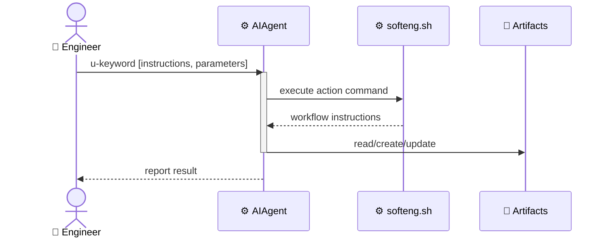
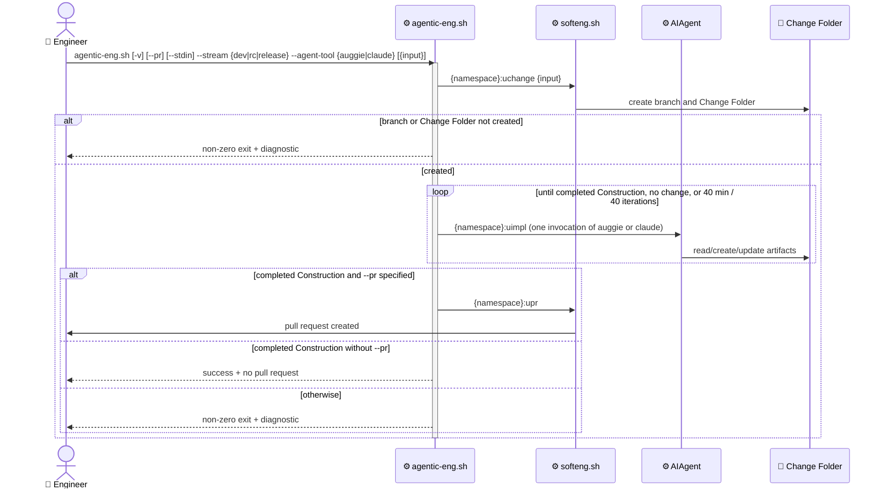

# Context architecture: softeng

## Overview

Most softeng actions follow a single uniform pattern. `👤 Engineer` triggers an action with a `u-keyword`, `⚙️ AIAgent` runs `softeng.sh` to get workflow instructions, reads/creates/updates artifact files, and runs shell commands. The result is reported back to `👤 Engineer`.

`uclarify` is the exception: it has no `softeng.sh` dispatch. `⚙️ AIAgent` reads the action body directly from `scripts/templates/actions/uclarify.md` (in installed plugins, the rendered command/skill) and executes its instructions.

`agentic-eng` is a further exception: it is not an `⚙️ AIAgent`-invoked action at all. `👤 Engineer` runs the standalone script `scripts/agentic-eng.sh` with input plus named `--stream` (`dev`, `rc`, or `release`) and `--agent-tool` (`auggie` or `claude`) parameters. The script orchestrates the whole change workflow by driving the selected tool in a loop -- inverting the generic pattern, so the script drives `⚙️ AIAgent` rather than the reverse.

## Key flows

### Generic flow

All softeng actions follow the same pattern:



### Instruction emission pipeline

Dispatched softeng actions use one shared instruction-emission pipeline. The command handler opens a structured `<LOG>`, performs deterministic shell work, queues optional artifacts, then calls `prompt_start_instructions <mode>` to close the log and stream agent-facing instructions directly to stdout.

```text
Engineer
  |
  v
u-keyword [options] [input]
  |
  v
AIAgent reads dispatch instructions
  |
  +-- derives command options
  +-- normalizes external references and inputs
  +-- runs the corresponding softeng action
  |
  v
softeng.sh action <name> {derived options}
  |
  v
action handler
  |
  +-- opens <LOG> (prompt_start_log)
  +-- validates preconditions and options (action-specific checks, git validators, error)
  +-- performs deterministic shell-side work (shell commands, git helpers, quiet)
  +-- computes prompt context variables (context_* helpers, declare -A *_vars)
  +-- optionally queues opaque artifacts (emit_artifact)
  |
  v
prompt_start_instructions <mode>
  |
  +-- closes </LOG>
  +-- opens <AGENT_INSTRUCTIONS>
  +-- writes mode preamble directly to stdout
  |
  v
emit_prompt streams prompt payload
  |
  +-- reads bin/prompts/{root}.md after ## data
  +-- filters direct (?condition) and (?!condition) lines
  +-- replaces `@include_*` references with include bodies
  +-- scans `@artdef_*` references before variable substitution
  +-- recursively renders artdefs depth-first, deduplicated
  +-- filters include-expanded conditional lines
  +-- substitutes `${context_var}` values
  +-- writes queued artifacts, artdefs, then root instruction directly to stdout
  |
  +-- process exits with status 0
  |     |
  |     v
  |   exit handler closes </AGENT_INSTRUCTIONS>
  |   AIAgent follows emitted instructions or reports results
  |
  +-- process exits non-zero before prompt_start_instructions
  |     |
  |     v
  |   exit handler closes </LOG>
  |   exit handler emits recovery <AGENT_INSTRUCTIONS>
  |   AIAgent reports failure from the log and stderr
  |   AIAgent offers numbered recovery options with Cancel last
  |   AIAgent stops until Engineer chooses an option
  |
  +-- process exits non-zero after prompt_start_instructions
        |
        v
      exit handler only closes </AGENT_INSTRUCTIONS>
      AIAgent treats the non-zero exit status as authoritative failure
      AIAgent uses stderr and any streamed log/instruction context only for diagnosis
```

`prompt_start_instructions <mode>` accepts exactly two mode values:

- `results`: the script has completed the deterministic part of the workflow and the emitted payload is a user-facing reporting contract. `AIAgent` ignores the preceding `<LOG>` for user-facing content, follows the result prompt, and reports or asks the `Engineer` exactly as instructed. `results` mode does not ask `AIAgent` to interpret artifacts as work to apply.
- `action`: the script has prepared the next workflow step and the emitted payload is an agent work contract. `AIAgent` consumes emitted `<artifact>` payloads and `<artdef>` definitions, then performs the requested reads, writes, commands, or follow-up action invocations before reporting completion or blockers to `Engineer`.

Missing mode values fail through `error`. Unknown mode values currently fail after `<AGENT_INSTRUCTIONS>` is opened; the exit handler then only closes the instruction tag.

This separates deterministic script responsibilities from agent responsibilities. Shell code owns validation, repository inspection, command execution, prompt context preparation, and instruction rendering. Prompt files own the agent-facing workflow contract. `AIAgent` owns interpretation of successfully emitted instructions, artifact authoring, and user reporting after the hand-off. After `prompt_start_instructions` opens `<AGENT_INSTRUCTIONS>`, stdout is instruction payload; handlers must avoid emitting diagnostic or deterministic-progress output there.

Action scripts fail fast under `set -Eeuo pipefail`. Expected validation failures call `error`, print `Error: ...` to stderr, and exit with status `1`. Unexpected command failures propagate through the same exit path unless the handler explicitly captures and handles the status. Commands that should be quiet on success use `quiet`: stdout and stderr are captured, suppressed on success, replayed on failure, and the original exit status is preserved. Cleanup and rollback use the shared `atexit` queue/stack; handlers run on every exit and preserve the command's original exit status.

The current implementation streams instructions; it does not buffer them atomically. Therefore a non-zero exit after `<AGENT_INSTRUCTIONS>` has opened can leave a partial instruction payload on stdout. In that case the non-zero exit status is authoritative: `AIAgent` must not continue partial instructions and should use stderr plus the streamed context only to explain the failure.

Key artifacts:

- [scripts/templates/actions/*.yaml](../../../../scripts/templates/actions)
  - dispatch-time instructions for deriving action options before `softeng.sh` runs
- [bin/softeng.sh](../../../../bin/softeng.sh)
  - action handlers perform deterministic shell-side work, prepare context variables, queue artifacts, and select root prompts
- [bin/_lib/utils.sh](../../../../bin/_lib/utils.sh)
  - `error` prints a user-readable error to stderr and exits with status `1`
  - `quiet` suppresses successful command noise while preserving and replaying failure output
  - `atexit_add`, `atexit_push`, and `atexit_pop` provide shared cleanup and rollback hooks
  - `prompt_start_log` opens `<LOG>`
  - `prompt_start_instructions` closes `<LOG>`, opens `<AGENT_INSTRUCTIONS>`, and writes the selected mode preamble
  - `emit_artifact` queues opaque payloads for the next prompt flush
  - `emit_prompt` writes directly to stdout, filters conditional lines, substitutes context variables, collects referenced `@artdef_*` dependencies, and flushes `<artifact>`, `<artdef>`, and `<instruction>` blocks
- [bin/prompts](../../../../bin/prompts/)
  - root instructions, reusable includes, and artifact definitions consumed by the renderer

### Self-review flow

`self-review` is a top-level softeng command (not an action). It is auto-invoked by `⚙️ AIAgent` at the end of a `uimpl` cycle that completed at least one to-do item, unless `--no-self-review` was passed to `uimpl`. Each stage prompt instructs `⚙️ AIAgent` to perform a scoped review, fix findings inline, and invoke the next stage. The chain ends with a results report to `👤 Engineer`.

```text
👤 Engineer
  |
  v
uimpl  (processes todos)
  |
  +--(--no-self-review)--> stop
  |
  v
Construction todos completed?
  |
  +--(no, specs only)--> self-review --type specs --stage A
  |                         |
  |                         v
  |                       review + fix inline
  |                         |
  |                         v
  |                       report -> 👤 Engineer
  |
  +--(yes)--> self-review --type construction --stage A
                |
                v
              review + fix inline
                |
                v
              self-review --type construction --stage B
                |
                v
              review + fix inline
                |
                v
              report -> 👤 Engineer
```

Key artifacts:

- [bin/softeng.sh](../../../../bin/softeng.sh)
  - `cmd_self_review` dispatch; `cmd_action_uimpl` emits the chain instruction
- [bin/prompts/instr_uimpl_todos.md](../../../../bin/prompts/instr_uimpl_todos.md)
  - trailing chain hand-off appended after todos are completed
- [bin/prompts/instr_self_review_specs_a.md](../../../../bin/prompts/instr_self_review_specs_a.md)
  - specs Stage A (terminal)
- [bin/prompts/instr_self_review_construction_a.md](../../../../bin/prompts/instr_self_review_construction_a.md)
  - construction Stage A -> B
- [bin/prompts/instr_self_review_construction_b.md](../../../../bin/prompts/instr_self_review_construction_b.md)
  - construction Stage B (terminal)
- [self-review.feature](self-review.feature)
  - functional design for the `self-review` command
- [uimpl.feature](uimpl.feature)
  - functional design for the uimpl auto-invoke scenarios

### Agentic engineering orchestration flow

`👤 Engineer` runs `scripts/agentic-eng.sh` with optional `-v`, `--pr`, and `--stdin` flags, input, named `--stream`, and named `--agent-tool`. The stream selects the uspecs namespace: `dev` uses `/uspecs-dev`, `rc` uses `/uspecs-rc`, and `release` uses `/uspecs`. The script passes the positional input, or stdin when `--stdin` is specified, to stream-specific `uchange`, fails fast if the branch or Change Folder was not created, then drives the selected tool in a bounded loop until a stop condition is met. When the Change Folder holds a completed Construction section, the script delegates to stream-specific `upr` only if `--pr` was specified; otherwise it exits successfully without opening a pull request.

With `-v`, the script writes issued commands, status, decisions, and summaries to stderr with `[agentic-eng]` category prefixes.



Key artifacts:

- [scripts/agentic-eng.sh](../../../../scripts/agentic-eng.sh)
  - orchestration script: argument validation, positional/stdin input, categorized verbose tracing, stream namespace mapping, `uchange` delegation, fail-fast, the bounded loop and stop conditions, the Construction gate, and optional `upr` delegation
- [agentic-eng.feature](agentic-eng.feature)
  - functional design for the agentic engineering orchestration workflow

### Examples

Non-exhaustive list of actions and their artifacts:

- uchange
  - dispatch: softeng.sh action uchange
  - input: change description, optional issue URL
  - output: Active Change Folder with change.md

- uarchive
  - dispatch: softeng.sh action uarchive
  - input: Active Change Folder or --all
  - output: Active Change Folder moved to changes/archive/

- agentic-eng
  - dispatch: scripts/agentic-eng.sh (standalone script, not a softeng.sh action)
  - input: optional `-v`/`--pr`/`--stdin`, change input, `--stream dev|rc|release`, and `--agent-tool auggie|claude`
  - output: completed change, pull request when `--pr` is specified, or non-zero exit with a diagnostic
