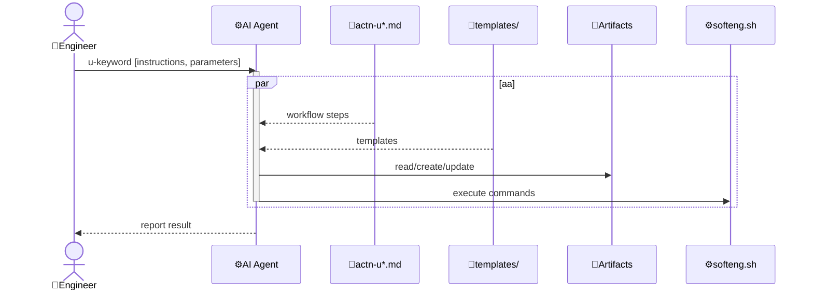

# Context architecture: softeng

## Overview

All softeng actions follow a single uniform pattern. The `Engineer` triggers an action with a `u-keyword`, and the `AI Agent` reads the corresponding `actn-u*.md` for workflow steps, fills in templates, reads/creates/updates artifact files, and runs shell commands via softeng.sh. The result is reported back to the Engineer.

## Key flows

### Generic flow

All softeng actions follow the same pattern:

### Examples

Non-exhaustive list of actions and their artifacts:

- uchange
  - action file: actn-uchange.md
  - input: change description, optional issue URL
  - output: Active Change Folder with change.md

- uarchive
  - dispatch: softeng.sh action uarchive
  - input: Active Change Folder or --all
  - output: Active Change Folder moved to changes/archive/

- uimpl
  - dispatch: softeng.sh action uimpl
  - input: Active Change Folder, impl.md or change.md
  - output: impl.md or change.md, spec files, codebase files

- upr
  - action file: actn-upr.md
  - input: Active Change Folder, change_branch
  - output: PR created on GitHub, pr_branch with squashed commits, change_branch deleted

- usync
  - dispatch: softeng.sh action usync [-y]
  - input: Working Change Folder, source changes since merge-base
  - output: Implementation Plan and specs aligned with source changes

- umergepr
  - action file: actn-umergepr.md (prompts via u/prompts.md)
  - input: Active Change Folder, open PR on current branch
  - output: PR squash-merged, branch deleted, WCF archived, Engineer notified
