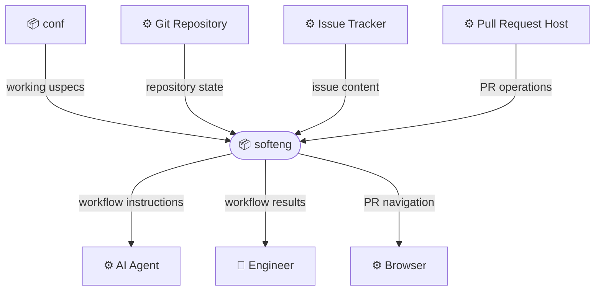
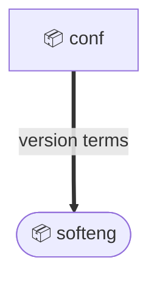
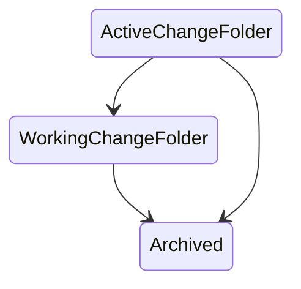
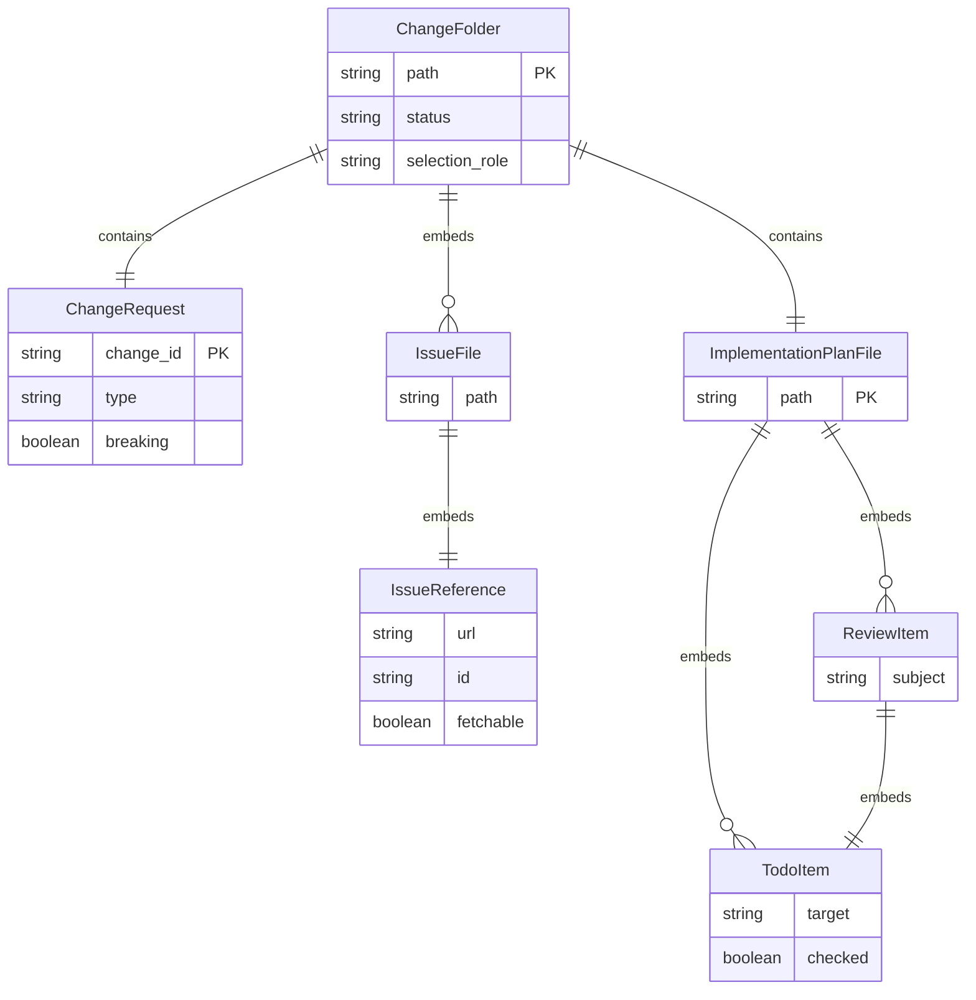

# Bounded Context: softeng

## Executive summary

Human-AI collaborative software engineering workflows driven by uspecs actions, change artifacts, implementation plans, and review loops.

Scope:

- Create and maintain `ChangeFolder`, `ChangeRequest`, `IssueFile`, implementation-plan sections, and todo state.
- Drive AI Agent workflows for clarification, specification updates, construction assistance, synchronization, self-review, archival, PR creation, PR merge handling, and version reporting.
- Emit workflow instructions through `softeng.sh` actions and top-level commands.
- Validate working tree, branch, and `ChangeFolder` preconditions for workflows that require them.

Out of scope:

- Installing or updating the uspecs plugin in an AI agent host.
- Owning project-specific product behavior specified under a user's own domains.
- Replacing Git, pull request hosting, issue trackers, browsers, or shell execution.
- Defining deployment and operations workflows owned by the devops domain.

## External actors

Roles:

- 👤 Engineer
  - Initiates uspecs workflows, provides decisions, reviews artifacts, and handles manual recovery when required.

Systems:

- ⚙️ AI Agent
  - Executes emitted instructions, edits artifacts, runs shell commands, and reports outcomes to the Engineer.
- ⚙️ Git Repository
  - Provides branches, merge bases, diffs, working tree status, and tracked source files.
- ⚙️ Pull Request Host
  - Provides PR lookup, creation, update, merge, and browser-opening behavior through PR tooling.
- ⚙️ Issue Tracker
  - Provides issue URLs and, when fetchable, issue body content for `ChangeRequest` creation.
- ⚙️ Browser
  - Opens PR pages or other external pages when workflows direct it.

## Relationships

### Service exposure

Arrows point upstream -> downstream. Edge style encodes the exposure pattern:

- `--->` solid: Open Host Service (ohs) - public, general-purpose contract for many consumers

#### conf -> softeng: working uspecs (ohs + pl)

Upstream:

- Canonical service contract detail: [conf](../conf/context.md)

Downstream:

- Depends on the installed plugin being runnable from the project root.
- Local conformity note: uses working uspecs and version terms as published.

#### Git Repository -> softeng: repository state (ohs + cf)

Upstream:

- External provider reference: Git command behavior.

Downstream:

- Reads working tree status, current branch, upstream tracking, merge base, branch diffs, and changed files.
- Local conformity note: adopts Git branch and diff terms directly for validation and synchronization workflows.

#### Issue Tracker -> softeng: issue content (ohs + cf)

Upstream:

- External provider reference: issue URL and issue body content.

Downstream:

- Extracts issue identity for branch naming, commit messages, and fetched issue files.
- Local conformity note: conforms to available issue URL structure and stores a local markdown issue file when the source is fetchable.

#### Pull Request Host -> softeng: PR operations (ohs + cf)

Upstream:

- External provider reference: pull request CLI behavior.

Downstream:

- Looks up PR state, creates PRs, updates branches, attempts squash merges, and opens PR pages.
- Local conformity note: conforms to PR states such as OPEN, CLOSED, and MERGED.

#### softeng: workflow instructions (ohs + pl)

Provider:

- Contract: action and self-review instruction output.
- Language: `SoftengWorkflowInstructions.v1`.
- Compatibility: backward-compatible additions for new action options, planning sections, validations, and review stages.

Consumers:

- ⚙️ AI Agent
  - Follows instructions emitted by `softeng.sh`, updates artifacts, runs commands, and reports results.

#### softeng: workflow results (ohs + pl)

Provider:

- Contract: user-facing action outcome reports.
- Language: `SoftengWorkflowResults.v1`.
- Compatibility: backward-compatible additions for new result details and recovery instructions.

Consumers:

- 👤 Engineer
  - Receives success, validation failure, recovery, review, and next-step information.

#### softeng: PR navigation (ohs)

Provider:

- Contract: browser-open behavior for PR pages.

Consumers:

- ⚙️ Browser
  - Opens PR pages when workflows direct the Engineer to inspect or handle a PR.

### Model alignment

Arrows point upstream -> downstream. Edge style encodes the alignment pattern:

- `===>` thick: Published Language (pl) - the upstream publishes a documented, versioned language/model
- `--->` solid: Conformist (cf) - the downstream adopts the upstream model as-is

#### conf -> softeng: version terms (pl)

Upstream:

- Canonical model detail: [conf](../conf/context.md)

Downstream:

- Uses the terms Stable build, Development build, installed version, latest available version, and update availability when reporting plugin version information.

## Model specification

### Entities

#### ChangeFolder (aggregate)

Folder containing change artifacts and lifecycle state.

Contains: `ChangeRequest`, `ImplementationPlanFile`.
Embeds: `IssueFile`, `IssueReference`, `ReviewItem`, `TodoItem`.

Fields:

| Field            | Type                     | Description                                                         |
|------------------|--------------------------|---------------------------------------------------------------------|
| `path`           | `string`                 | Folder path under `uspecs/changes/` or archive                      |
| `status`         | `string`                 | `WorkingChangeFolder`, `ActiveChangeFolder`, or `Archived`          |
| `selection_role` | `string`                 | Workflow selection role such as `ImplementationFolder`              |
| `change_request` | `ChangeRequest`          | `ChangeRequest` artifact                                            |
| `issue_files`    | `list<IssueFile>`        | Fetched issue artifacts                                             |
| `plan_file`      | `ImplementationPlanFile` | File currently used for planning and todo execution                 |

Invariants:

- Archived `ChangeFolder` values cannot be selected as `WorkingChangeFolder`.
- Actions that require a current change operate on exactly one `WorkingChangeFolder`.
- A `ReviewItem` remains unchecked until the Engineer has reviewed its subject.
- A `TodoItem` is checked only after its bounded instruction has been completed.

State transitions:

ERD:

##### ChangeRequest

`ChangeRequest` artifact recorded in `change.md`.

Owned by: `ChangeFolder`.

Fields:

| Field       | Type           | Description                                                             |
|-------------|----------------|-------------------------------------------------------------------------|
| `change_id` | `string`       | Stable folder-backed change identifier                                  |
| `type`      | `string`       | Conventional Commits type used for PR title and commit subject          |
| `domains`   | `list<string>` | Affected domain specification directories                               |
| `scope`     | `list<string>` | Context scopes used for commit and PR subjects when applicable          |
| `breaking`  | `boolean`      | Whether the change removes or incompatibly changes an existing contract |
| `issue_url` | `string`       | Optional external issue URL                                             |

##### ImplementationPlanFile

File containing planning sections and todo state.

Owned by: `ChangeFolder`.
Embeds: `ReviewItem`, `TodoItem`.

Fields:

| Field      | Type               | Description                           |
|------------|--------------------|---------------------------------------|
| `path`     | `string`           | `impl.md` or `change.md`              |
| `sections` | `list<string>`     | Planning sections present in the file |
| `todos`    | `list<TodoItem>`   | Todo items available for execution    |
| `reviews`  | `list<ReviewItem>` | Todo items awaiting Engineer review   |

#### PullRequest (aggregate)

Pull request associated with the current branch.

References: current branch from `Git Repository`.

Fields:

| Field    | Type     | Description                                 |
|----------|----------|---------------------------------------------|
| `url`    | `string` | Pull request URL                            |
| `state`  | `string` | OPEN, CLOSED, MERGED, or another host state |
| `branch` | `string` | Current branch associated with the PR       |

Invariants:

- `PullRequest.state` reflects the current branch's PR state from the Pull Request Host.
- `MERGED` is terminal for merge handling.
- `CLOSED` requires recovery or user action before merge handling can continue.

### Value Objects

#### ActionInvocation

Requested softeng workflow and options.

Fields:

| Field     | Type           | Description                                             |
|-----------|----------------|---------------------------------------------------------|
| `name`    | `string`       | Action or top-level command name                        |
| `keyword` | `string`       | User-facing u-command keyword such as `uchange`         |
| `options` | `list<string>` | Parsed options accepted by the command                  |
| `input`   | `string`       | User-provided description or parameters when applicable |

#### DiffScope

Source changes outside `uspecs/changes/` considered by synchronization workflows.

Fields:

| Field            | Type           | Description                                  |
|------------------|----------------|----------------------------------------------|
| `included_paths` | `list<string>` | Source paths included in synchronization     |
| `excluded_paths` | `list<string>` | Change-artifact paths excluded from the diff |

#### IssueFile

Markdown artifact saved from a fetchable issue.

Used by: `ChangeFolder`.

Fields:

| Field   | Type             | Description                                           |
|---------|------------------|-------------------------------------------------------|
| `path`  | `string`         | `issue-{issue_id}.md` file path in the `ChangeFolder` |
| `issue` | `IssueReference` | External issue identity represented by the file       |
| `body`  | `markdown`       | Issue body content captured from the external source  |

#### IssueReference

External issue identity used by change and PR workflows.

Used by: `ChangeFolder`, `IssueFile`.

Fields:

| Field       | Type      | Description                             |
|-------------|-----------|-----------------------------------------|
| `url`       | `string`  | External issue URL                      |
| `id`        | `string`  | Issue identifier extracted from the URL |
| `fetchable` | `boolean` | Whether the issue body can be fetched   |

#### RepositoryBaseline

Git comparison point for synchronization.

Used by: synchronization workflows.

Fields:

| Field            | Type        | Description                                                                 |
|------------------|-------------|-----------------------------------------------------------------------------|
| `remote`         | `string`    | PR remote name                                                              |
| `default_branch` | `string`    | Default branch name                                                         |
| `merge_base`     | `string`    | Merge-base commit                                                           |
| `diff_size`      | `integer`   | Size of diff considered by synchronization                                  |
| `diff_scope`     | `DiffScope` | Source-change set considered by synchronization                             |
| `diff_threshold` | `integer`   | Size limit that requires explicit confirmation before large synchronization |

#### ReviewItem

Todo item whose unchecked state intentionally stops implementation until the Engineer reviews the plan.

Used by: `ImplementationPlanFile`.

Fields:

| Field     | Type       | Description                                  |
|-----------|------------|----------------------------------------------|
| `todo`    | `TodoItem` | Todo item representing the review checkpoint |
| `subject` | `string`   | Plan section or artifact requiring review    |

#### TodoItem

Bounded instruction in a plan.

Used by: `ImplementationPlanFile`, `ReviewItem`.

Fields:

| Field      | Type           | Description                                                |
|------------|----------------|------------------------------------------------------------|
| `checked`  | `boolean`      | Whether the item is complete                               |
| `action`   | `string`       | Action verb such as create, update, fix, remove, or review |
| `target`   | `string`       | Artifact path or subject                                   |
| `subitems` | `list<string>` | Specific changes to make                                   |
