# Context architecture: softeng

## Key flows

### Generic flow

All softeng actions follow the same pattern:

```mermaid
sequenceDiagram
    actor engineer as 👤Engineer
    participant ai_agent as ⚙️AI Agent
    participant actn as 🎯actn-u*.md
    participant templates as 📄templates/
    participant artifacts as 📁Artifacts

    engineer->>ai_agent: u* keyword
    ai_agent->>actn: read workflow
    ai_agent->>templates: read output templates
    ai_agent->>artifacts: read/create/update
    ai_agent-->>engineer: report result
```

### Examples

Non-exhaustive list of actions and their artifacts:

- uchange
  - action file: actn-uchange.md
  - input: change description, optional issue URL
  - output: Active Change Folder with change.md

- uarchive
  - action file: actn-uarchive.md
  - input: Active Change Folder
  - output: Active Change Folder moved to changes/archive/

- uimpl
  - action file: actn-uimpl.md
  - input: Active Change Folder, impl.md
  - output: impl.md, spec files, codebase files

- udecs
  - action file: actn-udecs.md
  - input: change.md, optional decs.md
  - output: decs.md
