# Context architecture: softeng

## Overview

All softeng actions follow a single uniform pattern. The `Engineer` triggers an action with a `u-keyword`, and the `AI Agent` reads the corresponding `actn-u*.md` for workflow steps, fills in templates, reads/creates/updates artifact files, and runs shell commands via uspecs.sh. The result is reported back to the Engineer.

## Key flows

### Generic flow

All softeng actions follow the same pattern:

```mermaid
sequenceDiagram
    actor engineer as 👤Engineer
    participant ai_agent as ⚙️AI Agent
    participant actn as 🎯actn-u*.md
    participant templates as 📄templates/
    participant artifacts as 📁Artifacts
    participant uspecs as ⚙️uspecs.sh

    engineer->>ai_agent: u-keyword [instructions, parameters]
    activate ai_agent
    par aa
      actn -->> ai_agent: workflow steps
      templates-->>ai_agent: templates
      ai_agent->>artifacts: read/create/update
      ai_agent ->> uspecs: execute commands
      deactivate ai_agent
    end
    ai_agent-->>engineer: report result
```

### Examples

Non-exhaustive list of actions and their artifacts:

- uchange
  - action file: actn-uchange.md
  - input: change description, optional issue URL
  - output: Active Change Folder with change.md

- uarchive
  - action file: actn-uarchive.md
  - input: Active Change Folder
  - output: Active Change Folder moved to changes/archive/; on git cleanup, deleted branch hash and restore instructions reported to Engineer

- uimpl
  - action file: actn-uimpl.md
  - input: Active Change Folder, impl.md
  - output: impl.md, spec files, codebase files

- udecs
  - action file: actn-udecs.md
  - input: change.md, optional decs.md
  - output: decs.md

- upr
  - action file: actn-upr.md
  - input: Active Change Folder, change_branch
  - output: PR created on GitHub, pr_branch with squashed commits, change_branch deleted
