# Context architecture: softeng

## Key flows

### Create change

AI Agent creates the complete change folder structure, then uspecs.sh adds frontmatter metadata.

Responsibilities:

- AI Agent: fetch issue content, create folder structure with change.md

```mermaid
sequenceDiagram
    actor engineer as 👤Engineer
    participant ai_agent as ⚙️AI Agent
    participant actn_changes as 🎯actn-uchange.md
    participant issue_system as ⚙️Issue Tracking System
    participant change_folder as 📁Change Folder
    participant uspecs_sh as 📜uspecs.sh

    engineer->>ai_agent: uchange
    ai_agent->>actn_changes: read workflow
    opt with issue reference
        ai_agent->>issue_system: fetch issue content
        issue_system-->>ai_agent: content and URL
        ai_agent->>change_folder: create change.md with fetched content
        ai_agent->>uspecs_sh: add frontmatter --issue-url
    end
    opt without issue reference
        ai_agent->>change_folder: create change.md from template
        ai_agent->>uspecs_sh: add frontmatter
    end
    uspecs_sh->>change_folder: update change.md with frontmatter
```

- uspecs.sh: add frontmatter metadata to existing change.md via new command `uspecs.sh change frontmatter <change-md-path> [--issue-url <url>]`

### Implement change

```mermaid
sequenceDiagram
    actor engineer as 👤Engineer
    participant ai_agent as ⚙️AI Agent
    participant actn_impl as 🎯actn-uimpl.md
    participant specs as 📦specs
    participant codebase as 📦codebase

    engineer->>ai_agent: uimpl
    ai_agent->>actn_impl: read implementation rules
    ai_agent->>ai_agent: identify available to-do items
    ai_agent->>specs: create/update specifications
    ai_agent->>codebase: create/update code
    ai_agent->>ai_agent: check to-do items
```

