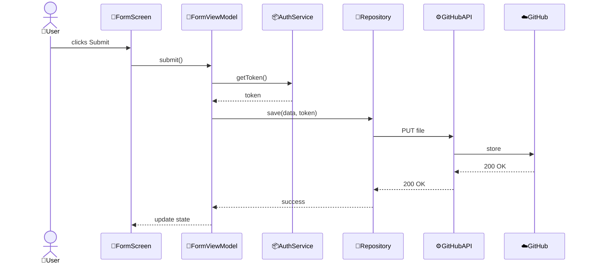
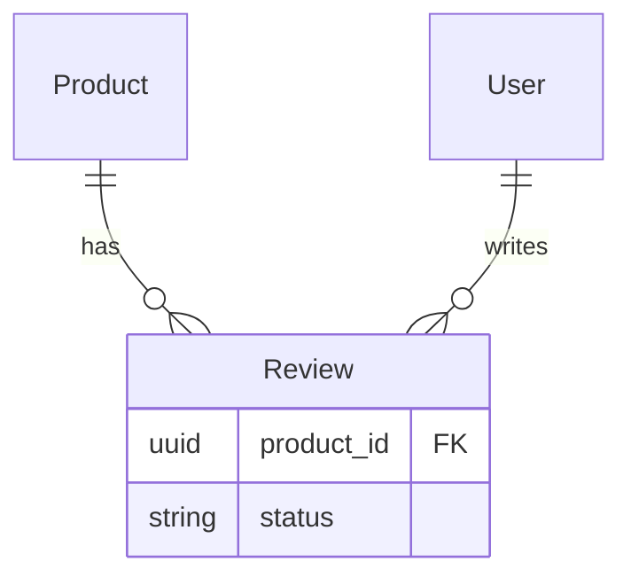

<!-- // TODO migrate parts to the skill -->

# Templates: Technical Design

## Overview

Structure:

```markdown
# Title
## Key components
## Key flows
## Key data models
```

## Title

- Domain Architecture
  - `# Domain architecture: {domain}`
- Domain Subsystem Architecture
  - `# Domain subsystem architecture: {subsystem}`
- Context Architecture
  - `# Context architecture: {domain}/{context}`
- Context Subsystem Architecture
  - `# Context subsystem architecture: {subsystem}`
- Feature Technical Design
  - `# Feature technical design: {feature}`

## Key components

Rules:

- All relative links must be correct paths from the file being edited to the target file
- Verify that relative paths resolve to the intended file before writing them

Format: `- [ComponentName: Type](path)` with one-line description.

Categories:

- Feature components - designed specifically for this feature
- Utility components - reusable utilities, include "Used by:" list
- 📦 System components - code in codebase but outside this feature, include "Used by:" list
- 📁 System storages - databases/caches owned by the system, outside this feature, include "Used by:" list
- ⚙️ External systems - third-party services, APIs (not in codebase), include "Used by:" list
- ☁️ External storages - third-party databases, external data sources, include "Used by:" list

Example:

```markdown
## Key components

Feature components:

- [OrderSummary: Widget](../../../lib/ui/checkout/order_summary.dart)
  - Displays order items and total price

- [ItemList: Widget](../../../lib/ui/checkout/item_list.dart)
  - Lists order items with quantities

Utility components:

- [TotalCalculator: class](../../../lib/utils/total_calculator.dart)
  - Add tax calculation for order totals
  - Used by: OrderSummary

- [PaymentValidator: class](../../../lib/utils/payment_validator.dart)
  - Add card expiry validation
  - Used by: PaymentForm

📦 System components:

- [CheckoutScreen: StatefulWidget](../../../lib/ui/checkout/checkout_screen.dart)
  - Add OrderSummary section
  - Used by: CheckoutFlow

📁 System storages:

- [OrdersDB: PostgreSQL](../../../docs/db-schema.md#orders)
  - Stores order records
  - Used by: OrderRepository

⚙️ External systems:

- [Stripe API: REST API](https://stripe.com/docs/api)
  - Payment processing
  - Used by: PaymentService

☁️ External storages:

- [Stripe Dashboard: External](https://dashboard.stripe.com)
  - Payment records and analytics
  - Used by: Finance team (manual)
```

## UI components

When to include: feature implemented using UI components.

UI component hierarchy shall be shown as ASCII tree with emojis:

- 🎯 Feature components
- 🔧 Utility components
- No emoji for external/framework components
- Use `...` to omit irrelevant parts

Example:

```text
CheckoutScreen
├── Header
│   └── ...
├── PaymentForm
│   ├── CardInput
│   └── PaymentValidator 🔧
└── OrderSummary 🎯
    ├── ItemList 🎯
    └── TotalCalculator 🔧
```

## Key flows

When to include: To describe key user/component interactions, control flow. Not more than 3 unless specially asked.

Format: Section with a mermaid sequence diagram.

Rules:

- Use sequenceDiagram ONLY
- Use actor keyword for roles
- Annotate diagrams with emojis:
  - 🎯 Feature components - designed specifically for this feature
  - 🔧 Utility components - reusable utilities, specifically to serve the feature
  - 📦 System components - code in codebase but outside this feature
  - 📁 System storages - databases/caches owned by the system, outside this feature
  - ⚙️ External systems - third-party services, APIs (not in codebase)
  - ☁️ External storages - third-party databases, external data sources

Example:

```markdown
## Key flows

### User submits transaction



---

## Key data models

When to include: Only what helps understand the design - critical enums, complex relationships, non-obvious constraints. Developers have the code, focus on the concept.

Use logical grouping (Domain layer, API layer, Database layer, etc.).

Use Mermaid ERD for 3+ related models with complex relationships.

### Example

**Domain layer:**

- ReviewStatus: PENDING (awaiting moderation) -> APPROVED (published) or REJECTED (flagged)

**Database relationships:**


